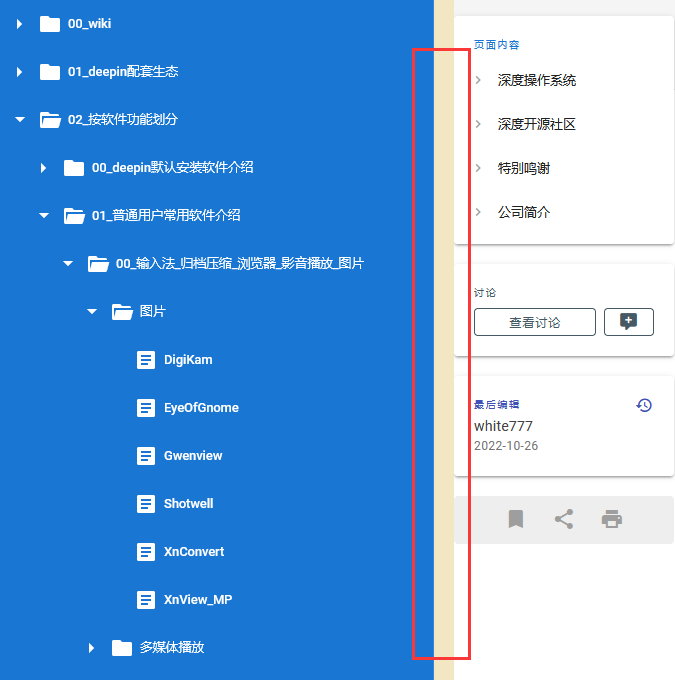

> 整体目录结构
> {.is-success}

### 00_wiki

* 目录结构
  * 00_wiki来源和共识
  * 01_wiki编辑人员申请
  * 02_wiki编辑规则说明
  * 03_wiki当前目录结构说明(也就是当前内容, 每当添加新的一级目录这里也要同步说明此目录的作用)
  * 04_wiki需求页(所有上述分类都不适合的信息, 后期wiki维护人员商议后会将其修改到合适的位置)
    统一需求入口, 希望某篇文章被记录在这里的, 可以在评论区留言, 已经记录的留言或者被评估不适合的信息将被删除

### 01_软件wiki

* 目录结构
  * 00_GUI软件
    * 01_deepin开发的软件
    * 02_社区人员维护的软件
    * 03_第三方开发的软件
  * 01_命令行软件
  * 02_开发库
  * 03_linux内核

### 02_硬件wiki

和硬件相关的知识

* 目录结构
  * 00_硬件知识
  * 01_设备适配列表

### 03_技术规范

deepin遵循的技术规范

### 04_FAQ

对常见问题的简短解答

### 05_HOW-TO

如何做某件事（此内文章都以 如何……作为开头）

**wiki阅读顺序**
不建议单独阅读wiki，应该配合guide进行学习，guide有指向wiki的链接。请善用wiki的搜索功能

**目录滑块插件**
[油猴脚本地址](https://greasyfork.org/zh-CN/scripts/453397-deepin-wiki-pc%E9%A1%B5%E9%9D%A2%E7%9B%AE%E5%BD%95%E6%BB%91%E5%9D%97)
安装后可以左右拖动目录显示范围, 示例图:

