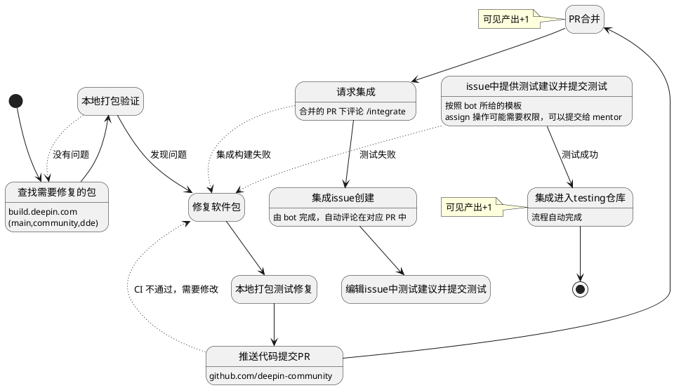

# 入门

## 重要链接一览

- [GitHub 软件包仓库](https://github.com/deepin-community/)
- [构建系统 - main 开发分支](https://build.deepin.com/project/show/deepin:Develop:main)
- [构建系统 - community 开发分支](https://build.deepin.com/project/show/deepin:Develop:community)

# 工作流

## 修包

# 