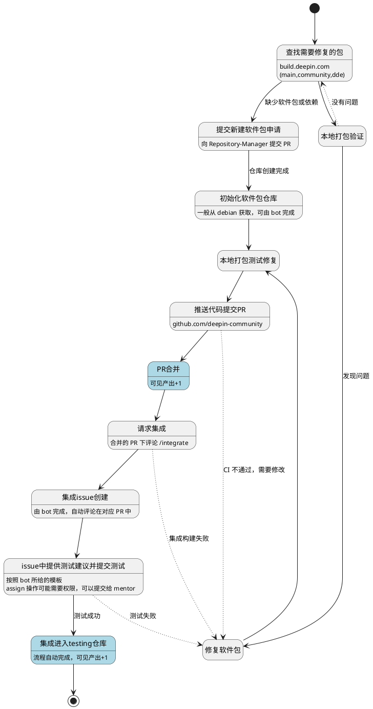

# 入门

## 重要链接一览

- [GitHub 软件包仓库](https://github.com/deepin-community/)
- [构建系统 - main 开发分支](https://build.deepin.com/project/show/deepin:Develop:main)
- [构建系统 - community 开发分支](https://build.deepin.com/project/show/deepin:Develop:community)

## 重要 Wiki 页面一览

- [协作指南](https://wiki.deepin.org/zh/05_HOW-TO/06_%E5%8F%82%E4%B8%8Edeepin%E8%B4%A1%E7%8C%AE%E7%9B%B8%E5%85%B3/deepin-community%E5%8D%8F%E4%BD%9C%E6%B5%81%E7%A8%8B)
- [集成流程说明](https://wiki.deepin.org/zh/03_%E6%8A%80%E6%9C%AF%E8%A7%84%E8%8C%83/00_%E8%BD%AF%E4%BB%B6%E5%8C%85%E4%B8%8E%E4%BB%93%E5%BA%93%E7%AE%A1%E7%90%86%E8%A7%84%E8%8C%83/%E9%9B%86%E6%88%90%E8%AF%B4%E6%98%8E)
- [分支与 tag 管理](https://wiki.deepin.org/zh/03_%E6%8A%80%E6%9C%AF%E8%A7%84%E8%8C%83/03_%E5%85%B6%E4%BB%96%E8%A7%84%E8%8C%83/deepin-community%E5%88%86%E6%94%AF%E4%B8%8ETag%E7%AE%A1%E7%90%86)
- [RISC-V 设备适配列表](https://wiki.deepin.org/zh/02_%E7%A1%AC%E4%BB%B6wiki/01_%E8%AE%BE%E5%A4%87%E9%80%82%E9%85%8D%E5%88%97%E8%A1%A8/deepin%E5%A4%9A%E6%9E%B6%E6%9E%84%E9%80%82%E9%85%8D%E6%9C%BA%E5%9E%8B%E6%B8%85%E5%8D%95)

## RISC-V 专用仓库

### 镜像

`https://ci.deepin.com/repo/deepin/deepin-ports/cdimage/`

### 附加软件包仓库

`https://ci.deepin.com/repo/deepin/deepin-ports/v23-addons/`

- `ports-imggpu`: Imagination GPU 驱动维护仓库
- `ports-kernel`: RISC-V 内核维护仓库
- `ports-board-*`: 设备专用软件包维护仓库

# 工作流

## 修包

# 注意事项

## 修包

入门常见问题：
- 一个 commit 对应一次修复，多次修改请 squash 合并后提交
- 一次修复对应一个 PR，不要反复关闭和创建 PR
- 每次提交的修改都请在 changelog 中新增条目并提升版本
- 除非升级版本，不要修改 `debian/` 目录以外的文件

一般常见问题：
- changelog 请对照检查版本号规则
- 一些包由于某些原因被锁定不可升级，有 bot 作对应检查
- 升级版本可自动化，有需要请与 mentor 联系