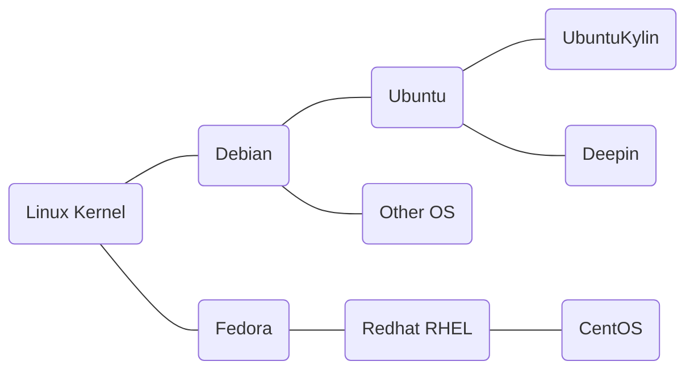
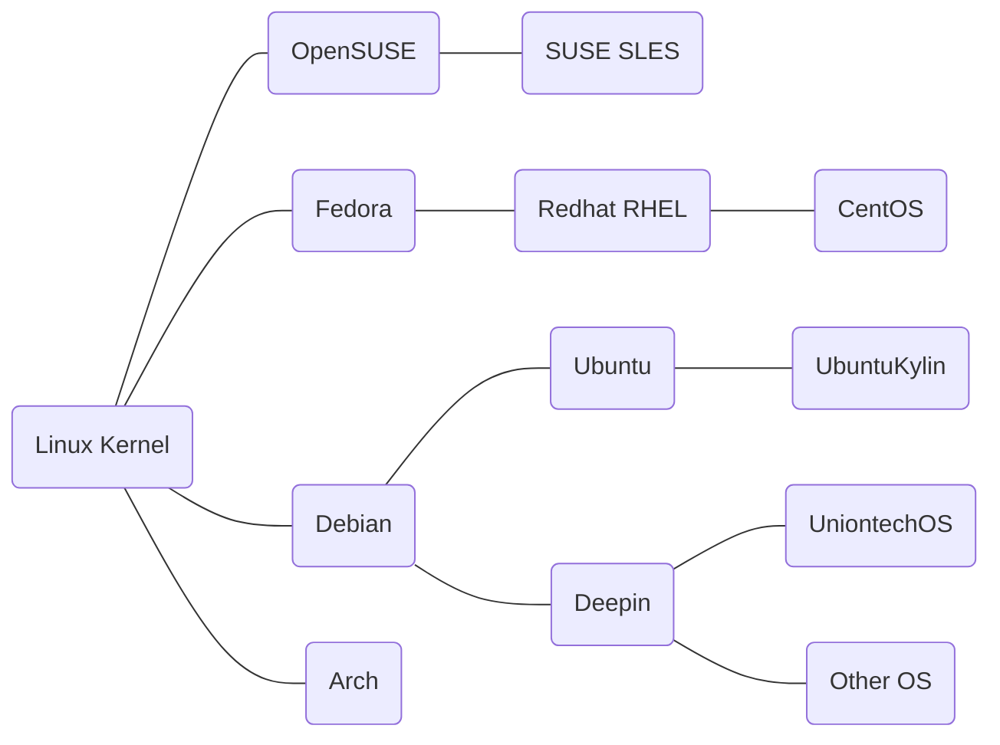
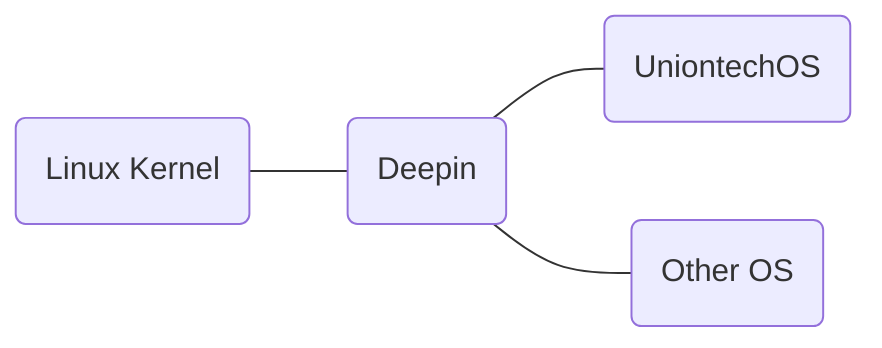

# Deepin Operating System
&emsp; Deepin is a Linux distribution dedicated to providing beautiful, easy to use, secure and stable services to users around the world, and has always been the highest ranked Linux distribution developed by a Chinese team .
## Mailstone  
### Release Plan in 2022 
https://www.deepin.org/en/developer-community/planning/
### Released in 2008-2015 years
- based on  ubuntu 

### Released in 2015-2022 years
- based on debian

    
### Plan of Deepin after 2022 year
- based on kernel

## Key features 
The differences between deepin and other distributions
- **DDE** (Deepin Desktop Environment)
- **Uengine** (Android Running Environment)
- **Deepin-wine** (Windows Running Environment)
## Offical applications
https://www.deepin.org/en/original/deepin-boot-maker/
## Source Code  
https://github.com/linuxdeepin
## Software Source  
https://www.deepin.org/en/mirrors/packages
## Image Source 
https://www.deepin.org/en/mirrors/releases

# Deepin Open Source Community
- **Declaration:** Open、Transparency、Innovation、Co-Creation
- **Code of conduct:** Respect、Friendly、Unity、Innovate
- **Organization Structure:** Administration teams 、 SIG
- **Iternational Communities:** Spain Community、Slovakia Community、Turkey Community、Brazil Community、France Community、Italy Community
- **Mailling list:** wiki@deepin.org
- [**More >>**](./about_deepin/deepin_community) 

# Deepin Wiki
## Introduction
wiki.deepin.org is Deepin community official wiki website for sharing the relevent technique of Deepin and Linux.
This is wiki.deepin.org content synchronization repository. wiki.deepin.org and github.com/linuxdeepin/wiki.deepin.org perform two-way synchronization every five minutes.Synchronization includes wiki page content, page information, publish status, and media resources, excluding page scripts and styles.

## How to use ?
### browsing
you can find the contents by your family language
- /en/ wiki contents in English
- /zh/ wiki contents in Chinese
### editting
You can submit contributions in two ways.
- Edit via website 
wiki.deepin.org is built using wikijs, with an easy-to-use interface and simple operation logic. We are currently recruiting contributors, welcome to click here to submit your contributions.
- Submit via git 
We recommend submitting contributions via git when multiple contents need to be imported or moved due to the inperfect function of batch operation in wikijs.
## How to contribute ?
The Deepin Wiki collects various information like experience of developing, system using as well as helpful tips, then shares them to users. You can also have your own contribution here!
**For example : join the SIG of deepin wiki**
- Editor Group：  
- Designer Group：
- Collector Group：

## [more >>](./about_deepin/README)
# Deepin Company Profile
&emsp; Established in 2011, Wuhan Deepin Technology Co., Ltd. (hereinafter referred to as Deepin Technology) is a commercial company focused on the R&D and service of Linux-based Chinese operating system.
&emsp; As the leading research and development team of operating systems in China, Deepin Technology aims to provide safe, reliable, beautiful and easy to use Chinese operating system and open source solutions. There are many professionals in system research and development, industry custom, internationalization, porting and adaptation, interaction design, support service and training, which can meet a wide range of needs to operating system products from different users and application scenarios.
&emsp; As the creator of Chinese operating system ecology, Deepin Technology not only built close working relationships with chip, computer, middleware, database and other manufacturers, but also jointly developed lots of applications for Chinese users with Kingsoft, NetEase, Crossover and other companies. Its operating system product has been widely used in the government, finance, communication,education and other fields.

