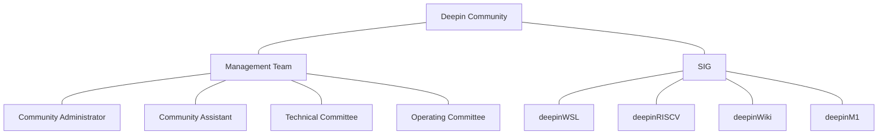
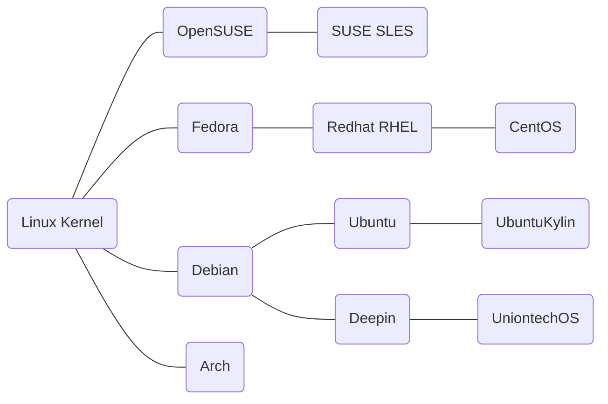
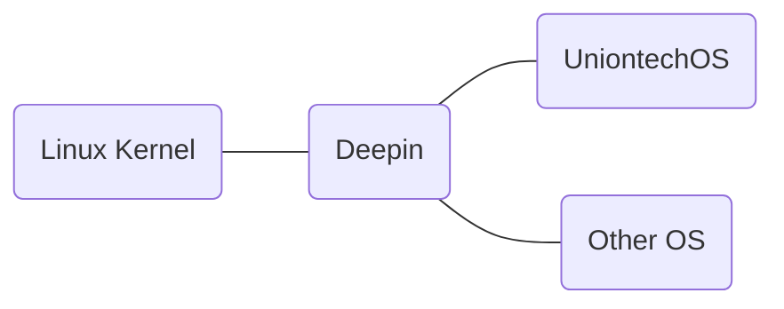

# The declaration of the community
- Open
- Transparency
- Innovation
- Co-Creation
# Code of conduct
[Reference](https://www.contributor-covenant.org/version/1/4/code-of-conduct/)
# SIG & Teams
## Administration teams
- Community Administrator
- Community Assistant
- Technical Committee
- Operating Committee
## SIG 
Special interest groups
- deepinWSL
- deepinRISCV
- deepinWiki
- deepinM1

## Community Organization Structure

# Mailstone  
## History of Deepin 2022 years ago

    
## Plan of Deepin after 2023 years 

   
# Iternational Communites
- Spain Community
- Slovakia Community
- Turkey Community
- Brazil Community
- France Community
- Italy Community

# Mailling list
- wiki@deepin.org
   
   
   
  
  
  
